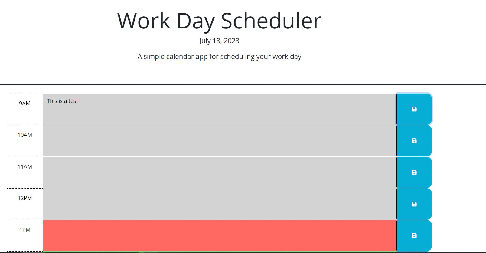

# challenge-5

This is a calendar where you can save events from 9:00 am to 5:00 pm. This will change its colors according to the current time: if it's past, present or future:

-Grey for past
-Read for present
-Green for future

Comments have been added to the js file for better understanding. 

